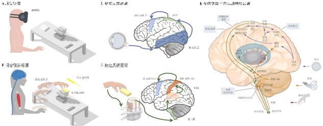

  
  <!-- 75%宽度 -->
    Bachelor
    
<i>Beihang University, Beijing, China</i>

    
<i>Engineering in Biomedical Engineering</i>

    
<i>Sep 2022 – Jul 2026</i>

    
<i>Email: dsjzzn@buaa.edu.com</i>

    
<i>ORCID: https://orcid.org/0009-0006-4632-263X</i>

    
<i>Research interest: Brain-Computer Interface, Artificial Intelligence, Neurorehabilitation, Mixed Reality</i>

    
<i>Advisors: Prof. Tao Liu, Prof. Xiaoyu Liu</i>

  

  
  <!-- 25%宽度 -->
    
  

Publications  
---
**A Personalized Multi-modal Hand Function Assessment and Rehabilitation Platform**  
***Songjun Du**, Yijin Li, Tao Liu*  
*Beijing Natural Science Foundation QY24143*  
*Funded, Oct 2024*    

**A Mixed Reality-Based System for Upper Limb Motor Assessment in Stroke Patients with Reduced Cognitive Load**  
***Songjun Du**, Ying Dong, Xiaoyu Liu, Yubo Fan*    
*Oral Presentation, 2025 China Biomedical Engineering Conference & Medical Innovation Summit*  
*Accepted, 2025.5*

**An MR-Based Upper Limb Motor Assessment System for Stroke Patients with Reduced Cognitive Load**  
***Songjun Du**, Ying Dong, Xiaoyu Liu*  
*Oral Presentation, International Conference on Intelligent Rehabilitation and Human Ergonomics*  
*Accepted, 2025.4*  

**An Optimization Strategy Allowing a Tactile Glove with Minimal Tactile Sensors for Soft Objects Identification**  
*Min Tang, Xiaoyu Liu, …, **Songjun Du**, et al.*  
*IEEE JBHI, Accepted, 10.1109/JBHI.2025.3576248 [PDF](https://ieeexplore.ieee.org/stamp/stamp.jsp?tp=&arnumber=11023023)*

Awards  
---

**Special Prize (Top 0.5%)**, *33rd Fengru Cup Innovation Competition, 2023*  
**First Prize (Top 1%)**, *9th National Biomedical Engineering Innovation Contest, 2024*  
**Special Prize (Top 1%)**, *19th “Challenge Cup” National Innovation Program, 2024*  
**Fengru Star of Innovation and Entrepreneurship**, *Beihang University, 2023*  
**Innovation and Entrepreneurship Scholarship**, *Beihang University, 2024*  
**First-Class Scholarship for Social Practice**, *Beihang University, 2024*  
**Second Prize (Top 10%)**, *34rd Fengru Cup main Competition, 2024*  
**First Prize (Top 2%)**, *35rd Fengru Cup main Competition, 2025*  

Patents  
---

**Invention Patent**: Multi-modal Hand Function Rehabilitation System and Method *CN 118787340 A*  
*Public Disclosure, Jun 2024*  
**Software Copyright**: Personalized Multi-modal Hand Function Assessment Platform *2024SR0743523*  
*Granted, May 2024*  
**Invention Patent**: A Thermal Imaging-Based Method for 3D Targeting in Orthopedic Shockwave Therapy  
*Under Review, Research-to-Practice Program*

Experience  
---
### Mixed Reality-Based Upper Limb Assessment System  
*Jan 2025 – Present* | *First Author*  
- Developed a mixed reality system using Pico4 Ultra HMD for upper limb motor function assessment.  
- Integrated eye tracking and inverse kinematics to minimize cognitive load in motion capture.  
- Planned clinical validation at Beijing Geriatric Hospital.  
- Target journal: *Journal of NeuroEngineering and Rehabilitation (JNER)*.  
    

### Multi-modal Hand Function Assessment & Rehabilitation Platform  
*Sep 2023 – Present* | *First Author*  
- Designed a system integrating flex, IMU, and sEMG sensors with CNN-LSTM models for motor state evaluation.  
- Developed a PyQt5 GUI and pneumatic glove controller.  
- Secured invention patent and software copyright.  
     

### 3D Targeting for Orthopedic Shockwave Therapy  
*Sep 2023 – Dec 2023* | *Co-First Author*  
- Combined infrared thermography, YOLO detection, and depth mapping for accurate target area reconstruction in physiotherapy.  
     

### EEG-Based Cognitive Load Analysis in Flight Simulation  
*Feb 2024 – Present* | *Co-First Author*  
- Analyzed EEG signals from 18 pilots using band power and deep learning models (MLP, ADFCNN, Conformer) for cognitive state estimation.  
- Preparing manuscript for *IEEE BIBM*.  
<!--       -->

### Hybrid Wheeled-Legged Exoskeleton Design  
*Dec 2022 – May 2023* | *Only Author*  
- Designed an exoskeleton integrating wheeled and legged locomotion, modeled in SolidWorks.  
- Presented animated simulations; won top innovation prize at Fengru Cup.  
     

### Deep Learning and Biomechanics-Based Myopia Risk Model  
*Aug 2024 – Oct 2024* | *Software Developer*  
- Developed a PyQt5 tool for myopia risk prediction using image segmentation, 3D modeling, and risk scoring.  
- Received top award in the *19th “Challenge Cup” National Innovation Program*.  
     

Extracurricular  
---

- **Starting Player**, School Football Team, *School of Biomedical Engineering, Beihang University, 2022–2024*  
- **President**, BUAA Parkour Association (*3-star rated student society, 2023–2025*)  
- **Organizer**, BUAA-Kingsoft Summer Practice Program, *2024*  Recognized as *Outstanding City-level Team*  
- **Media Assistant**, Career Development Center, *Beihang University, 2024–2025*  Responsibilities: Company liaison, interviews, video editing