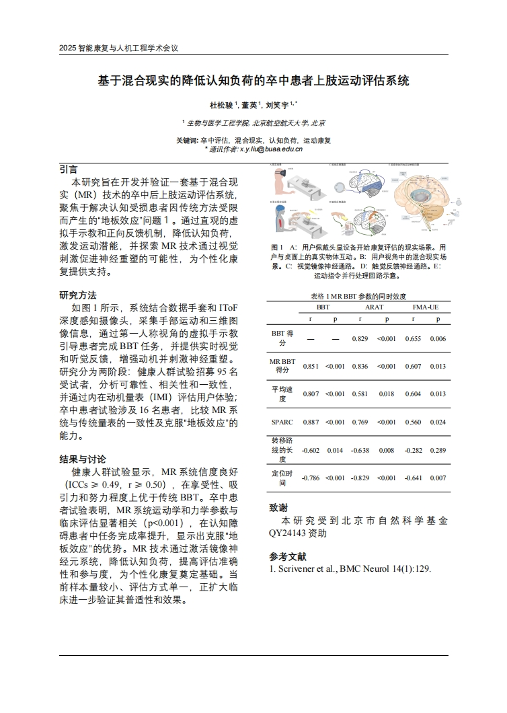

Bachelor of Engineering in Biomedical Engineering

*Beihang University, Beijing, China*  
*Sep 2022 – Jul 2026*  
*Email: [dsjzzn@buaa.edu.com](mailto:dsjzzn@buaa.edu.com)*  
*Advisors: Prof. Tao Liu, Prof. Xiaoyu Liu*

$\color{BlueViolet} \textsf {Publications}$  
---
### Beijing Natural Science Foundation  
**A Personalized Multi-modal Hand Function Assessment and Rehabilitation Platform**  
***Songjun Du**, Yijin Li, Tao Liu*  
*QY24143* 
*Funded, Oct 2024*  

### IRHE Conference 2025  
**An MR-Based Upper Limb Motor Assessment System for Stroke Patients with Reduced Cognitive Load**  
***Songjun Du**, Ying Dong, Xiaoyu Liu*  
*Oral Presentation, International Conference on Intelligent Rehabilitation and Human Ergonomics*  
*Accepted, 2025*  
  

### IEEE JBHI  
**An Optimization Strategy Allowing a Tactile Glove with Minimal Tactile Sensors for Soft Objects Identification**  
*Min Tang, Xiaoyu Liu, …, **Songjun Du**, et al.*  
*Under Review, Submitted Apr 2025*

$\color{BlueViolet} \textsf {Awards}$  
---

**First Prize (Top 0.5%)**, *33rd Fengru Cup Innovation Competition, 2023*  
**First Prize (Top 1%)**, *9th National Biomedical Engineering Innovation Contest, 2024*  
**Special Prize (Top 1%)**, *19th “Challenge Cup” National Innovation Program, 2024*  
**Fengru Star of Innovation and Entrepreneurship**, *Beihang University, 2023*  
**Innovation and Entrepreneurship Scholarship**, *Beihang University, 2024*  
**First-Class Scholarship for Social Practice**, *Beihang University, 2024*

$\color{BlueViolet} \textsf {Patents}$  
---

**Invention Patent**: Multi-modal Hand Function Rehabilitation System and Method *CN 118787340 A*  
*Public Disclosure, Jun 2024*  
**Software Copyright**: Personalized Multi-modal Hand Function Assessment Platform *2024SR0743523*  
*Granted, May 2024*  
**Invention Patent**: A Thermal Imaging-Based Method for 3D Targeting in Orthopedic Shockwave Therapy  
*Under Review, Research-to-Practice Program*

$\color{BlueViolet} \textsf {Research Experience}$  
---
### Mixed Reality-Based Upper Limb Assessment System  
*Jan 2025 – Present* | *First Author*  
- Developed a mixed reality system using Pico4 Ultra HMD for upper limb motor function assessment.  
- Integrated eye tracking and inverse kinematics to minimize cognitive load in motion capture.  
- Planned clinical validation at Beijing Geriatric Hospital.  
- Target journal: *Journal of NeuroEngineering and Rehabilitation (JNER)*.  
    

### Multi-modal Hand Function Assessment & Rehabilitation Platform  
*Sep 2023 – Present* | *First Author*  
- Designed a system integrating flex, IMU, and sEMG sensors with CNN-LSTM models for motor state evaluation.  
- Developed a PyQt5 GUI and pneumatic glove controller.  
- Secured invention patent and software copyright.  
     

### 3D Targeting for Orthopedic Shockwave Therapy  
*Sep 2023 – Dec 2023* | *Co-First Author*  
- Combined infrared thermography, YOLO detection, and depth mapping for accurate target area reconstruction in physiotherapy.  
     

### EEG-Based Cognitive Load Analysis in Flight Simulation  
*Feb 2024 – Present* | *Co-First Author*  
- Analyzed EEG signals from 18 pilots using band power and deep learning models (MLP, ADFCNN, Conformer) for cognitive state estimation.  
- Preparing manuscript for *IEEE BIBM*.  
<!--       -->

### Hybrid Wheeled-Legged Exoskeleton Design  
*Dec 2022 – May 2023* | *Independent Author*  
- Designed an exoskeleton integrating wheeled and legged locomotion, modeled in SolidWorks.  
- Presented animated simulations; won top innovation prize at Fengru Cup.  
     

### Deep Learning and Biomechanics-Based Myopia Risk Model  
*Aug 2024 – Oct 2024* | *Software Developer*  
- Developed a PyQt5 tool for myopia risk prediction using image segmentation, 3D modeling, and risk scoring.  
- Received top award in the *19th “Challenge Cup” National Innovation Program*.  
     

$\color{BlueViolet} \textsf {Extracurricular Activities}$ 
---

- **Starting Player**, School Football Team, *School of Biomedical Engineering, Beihang University, 2022–2024*  
- **President**, BUAA Parkour Association (*3-star rated student society, 2023–2025*)  
- **Organizer**, BUAA-Kingsoft Summer Practice Program, *2024*  Recognized as *Outstanding City-level Team*  
- **Media Assistant**, Career Development Center, *Beihang University, 2024–2025*  Responsibilities: Company liaison, interviews, video editing